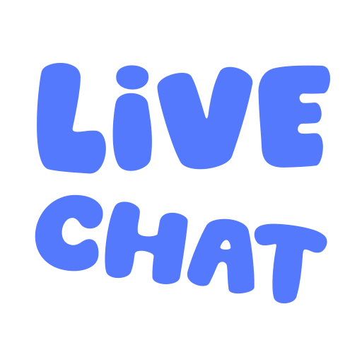

<p align="center">
  
</p>

**LiveChat**, inspiré par la Cacabox, est l'outil ultime pour rendre vos streams intéractifs.

Il s'agit d'un **bot Discord couplé à un overlay de stream** qui permet à vos amis et vos modérateurs d'afficher instantanément des images, de lancer des vidéos ou de jouer des sons directement sur votre live, via une simple commande Discord (`/livechat`).

## 🎬 Démonstration

https://github.com/user-attachments/assets/9ce415c4-f99e-4041-8c8e-b504fc0dd6fa

## ✨ Fonctionnalités

- 🔗 **Partage facile :** Prends en charge nativement les liens **Discord**, **TikTok**, **Twitter**, **Tenor**, et **Giphy**. Vous pouvez également partager des fichiers directement depuis votre ordinateur. _L'ajout d'autres plateformes comme YouTube sont prévues._
- 👥 **Mode Stream Together (Multi-streameurs) :** Vous streamez à plusieurs sur le même serveur Discord ? Utilisez l'option `📌 Envoyer à tous les streameurs connectés` pour qu'une vidéo s'affiche sur les streams de tous vos amis en même temps !
- 📝 **Générateur de mèmes :** Superposez du texte sur les médias envoyés avec la police Impact pour créer des mèmes en direct grâce à l'option `texte` de la commande `/livechat` !
- 🔒 **Sécurisé :** LiveChat vous protège contre les fuites d'adresse IP grâce à son système de proxy intégré.
- 🌐 **Universel :** Fonctionne avec toutes les plateformes de streaming (Twitch, YouTube, Kick, TikTok, etc.) et n'importe quel logiciel de streaming supportant les sources navigateur (OBS Studio, Streamlabs Desktop, PRISM Live, etc.).

Et bien plus encore, installez-le et jouez avec pour le découvrir !

## 🚀 Installation & Utilisation

L'installation est simple, prenez le temps de tout lire et ça marchera du premier coup.

1. Rendez-vous sur le site : **[https://livechat.nevylish.fr/](https://livechat.nevylish.fr/)**
2. Cliquez sur **"Configurez votre overlay"**.
3. Suivez les étapes pour ajouter le bot à votre serveur Discord, obtenir votre lien d'overlay et le configurer.

_(Un tutoriel vidéo complet sera disponible prochainement)._

---

## 💻 Pour les développeurs

Vous souhaitez héberger votre propre instance de LiveChat, modifier le code ou contribuer au projet ? Voici la marche à suivre.

### 🛠️ Prérequis

- **Node.js** (version 18 ou supérieure)
- **npm** ou **pnpm**
- Un serveur Discord avec un bot prêt
- Un logiciel de streaming avec support de navigateur (OBS Studio, Streamlabs, etc.) ou un navigateur Chromium

---

### 📦 Installation

1. **Cloner le dépôt** :

```bash
git clone https://github.com/nevylish/LiveChat.git
cd LiveChat
```

2. **Installer les dépendances** :

```bash
npm install
#ou
pnpm install
```

3. **Configurer l'environnement** :
   Créez un fichier `.env` à la racine du projet :

```env
DOMAIN=localhost
LIVECHAT_PORT=3000
TOKEN=token_de_votre_bot_discord
TENOR_API_KEY=clé_api_tenor
GIPHY_API_KEY=clé_api_giphy
SKU_PLUS_ID=facultatif
SKU_PRO_ID=facultatif
```

4. **Lancer l'application**

```bash
npm run dev
#et
npm run start
```

### Scripts disponibles

| Commande         | Description                                                           |
| ---------------- | --------------------------------------------------------------------- |
| `npm run dev`    | Compile le TypeScript en mode watch (recompilation automatique)       |
| `npm run build`  | Compile le TypeScript pour la production                              |
| `npm run start`  | Lance l'application                                                   |
| `npm run clean`  | Nettoie le dossier de build (dist/) et recopie les fichiers statiques |
| `npm run format` | Formate le code avec Prettier                                         |

## 🐳 Déploiement rapide avec Docker Compose

```bash
# Cloner le repository
git clone https://github.com/nevylish/LiveChat.git
cd LiveChat

# Configurer les variables d'environnement
cp .env.example .env
# Éditez .env avec vos paramètres

# Lancer avec Docker Compose
docker-compose up -d
```

## ✨ Contributions

Ce projet est ouvert aux contributions. Ouvrez une issue pour qu'on en discute !

---

<div align="center">

<sub>© Nevylish — LiveChat. Tous droits réservés.</sub>
<br />
<sub>Non affilié à Twitch, Cacabox ou toute autre marque, plateforme ou personne tierce.</sub>

</div>
